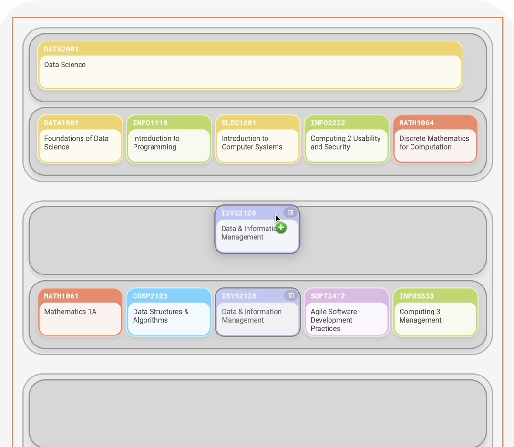
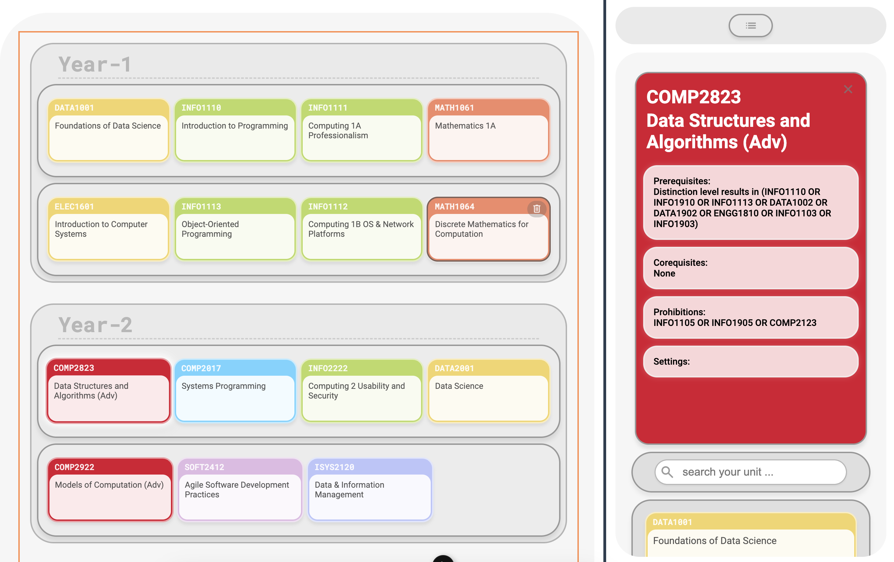
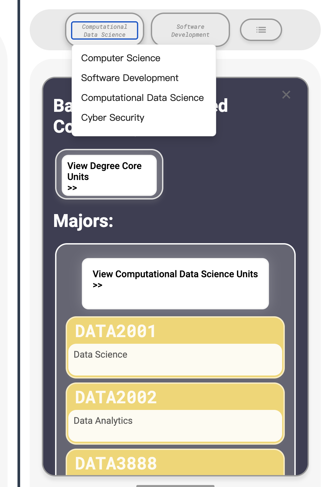
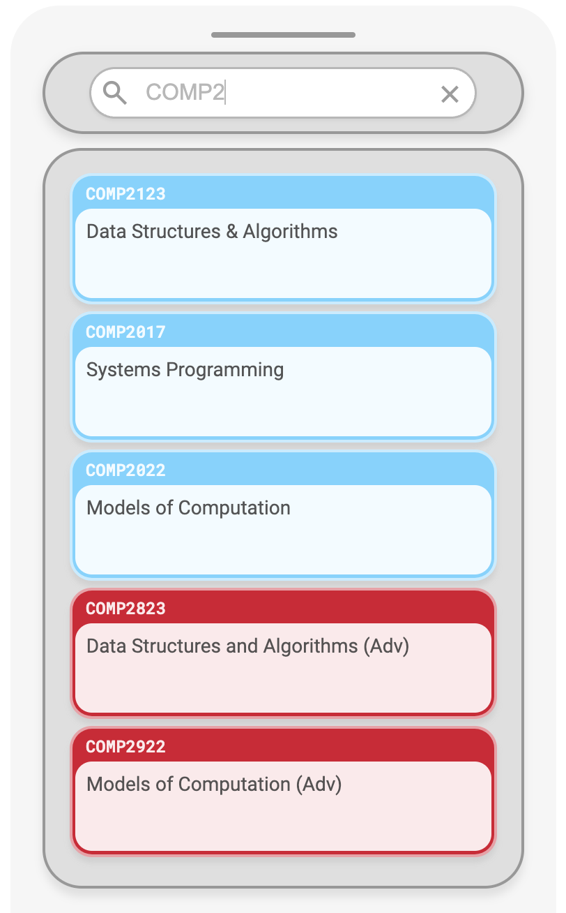

# Building the new CUSP/Unit of Study Selection Helper - USYD TABS v2 merged! (Name not finalised)
# Building the new CUSP/Unit of Study Selection Helper - USYD TABS v2 merged! (Name not finalised)
---
README V1.03 Apr 12th 2024
USYD tabs v2 dev - check: https://github.com/cheese-zj/tabs-v2-stream
README V1.03 Apr 12th 2024
USYD tabs v2 dev - check: https://github.com/cheese-zj/tabs-v2-stream
V2 running at: https://tabs-usyd.vercel.app/
### Why we need need a new CUSP anyway?
The current course selection system, CUSP, is complex and unintuitive, often requiring information from various sources for course selection. This manual process is especially challenging for freshmen, gap year students, students attending exchange programs or combined degrees, or those who have failed courses.
### The Solution:
We're introducing a new course selection web app for the University of Sydney, designed to be efficient, dynamic, and user-friendly. Initially, it will support the Bachelor of Advanced Computing Degree units, using Vue.js 3.0 with Nuxt and JavaScript/TypeScript for processing, ensuring a maintainable foundation.
### Future about this project, what are we looking for:
Our roadmap includes expanding to include comprehensive course information and integrating a complete database, committing to continuous development and maintenance for in-depth educational planning.

---
# Project access and setups:

## This Repo is currently running at https://definitely-not-cusp.vercel.app/ 
## Check https://tabs-usyd.vercel.app/ for v2 updates

## Setup locally:
### Setup

Make sure to install the dependencies:

```shell
# yarn
yarn

# npm
npm install

# pnpm
pnpm install --shamefully-hoist
```

### Development Server

Start the development server on [http://localhost:3000](http://localhost:3000/)

```shell
npm run dev
```

### Production

Build the application for production:

```shell
npm run build
```

Locally preview production build:

```shell
npm run preview
```

---
# Functions v2 (early):
# Functions v2 (early):
Apr 10th Wed Version:
### Overlook at the page:

### Course Selection Area:
- Year and Semester Layout: The system organises courses into "Year 1," "Year 2," etc., further subdivided into "Semester 1" and "Semester 2," visually arranging students' course plans for each term.
- Course Unit Area: Each semester features multiple boxes where different course units are placed. These units are colour-coded by category, with units sharing the same course prefix displayed in the same colour. Users can add courses by dragging and dropping units; duplicate courses cannot be added, and any course can be removed by clicking its top right corner. Clicking on a course unit reveals detailed information on the right side.

### Course Selection Area:
- Year and Semester Layout: The system organises courses into "Year 1," "Year 2," etc., further subdivided into "Semester 1" and "Semester 2," visually arranging students' course plans for each term.
- Course Unit Area: Each semester features multiple boxes where different course units are placed. These units are colour-coded by category, with units sharing the same course prefix displayed in the same colour. Users can add courses by dragging and dropping units; duplicate courses cannot be added, and any course can be removed by clicking its top right corner. Clicking on a course unit reveals detailed information on the right side.
### Top Navigation Area:
- Degree Selection: Users can select their desired degree from a dropdown menu, such as "Bachelor of Advanced Computing."
- Major Selection: Provides two slots for users to choose their majors, for example, "Computational Data Science" and "Software Development."
- Guidance Panel: After selecting the degree and major, clicking on the guidance panel to the right reveals a dark sidebar. This displays the chosen degree and the core course units pertinent to the selected major, aiding students in understanding the offerings across different degrees and majors.
### Sidebar:
- This includes a search box, enabling users to swiftly locate specific course units by keyword, thus increasing efficiency.
- Below the search box, the sidebar serves as a reservoir of courses from which users can drag and drop to refine their selection.

#### Dragging unit items around!


#### Selected unit description (not fully finished):

#### Degree and major core unit helper (now only supports Bachelor of Advanced Computing)


#### Degree and major core unit helper (now only supports Bachelor of Advanced Computing)

#### Search your unit up:

